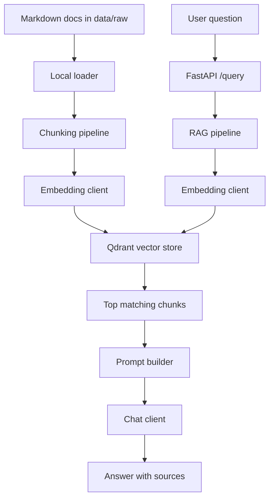
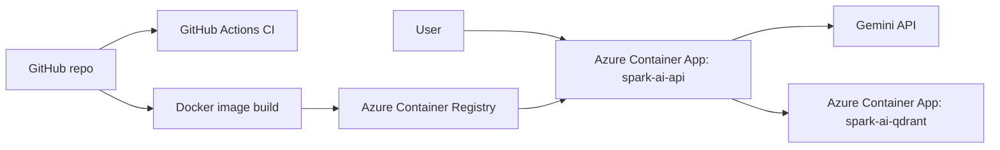

# Spark AI RAG Assistant

Spark AI RAG Assistant is a FastAPI-based retrieval-augmented generation backend for Confluence-style internal documentation. It ingests markdown documents with front matter, chunks them while preserving metadata, stores embeddings in Qdrant, and answers questions with grounded context and cited sources.

The project currently supports provider-based model selection:
- `gemini` for embeddings and answer generation
- `ollama` as a local fallback provider path

## Project Overview

The goal of this project is to build a production-style RAG assistant that can:
- ingest internal documentation from local markdown files
- preserve document metadata during chunking and indexing
- store vectors in Qdrant for semantic retrieval
- assemble grounded prompts from retrieved chunks
- generate answers through a configurable LLM provider
- expose retrieval and query APIs through FastAPI
- run locally, in Docker, and on Azure Container Apps

## Architecture

### High-level flow



### Deployment architecture



### Important architecture decisions

- FastAPI is used for a simple, inspectable backend API surface.
- Metadata is preserved on every chunk so responses can cite document identity, title, section, and source.
- Provider factories in [providers.py](c:/Users/Daily%20Use/Documents/GitHub/spark-ai-rag-assistant/app/core/providers.py) keep model selection simple without introducing heavy abstraction.
- Qdrant is treated as an external service boundary, which keeps retrieval logic easy to test and reason about.
- Integration tests are explicitly marked with `pytest.mark.integration` so local and CI test flows can exclude service-dependent tests cleanly.

## Folder Structure

```text
.
|-- app/
|   |-- api/            # FastAPI routes
|   |-- core/           # config and provider factories
|   |-- embeddings/     # Gemini and Ollama embedding clients
|   |-- generation/     # Gemini and Ollama chat clients, prompt builder
|   |-- ingestion/      # local file loading and chunking
|   |-- retrieval/      # RAG pipeline
|   |-- schemas/        # Pydantic data models
|   `-- vectorstore/    # Qdrant integration
|-- data/raw/           # local knowledge base markdown files
|-- docker/             # Docker image definition
|-- scripts/            # indexing, search, and local CLI helpers
|-- tests/              # unit-ish and integration tests
|-- .github/workflows/  # CI workflow
|-- docker-compose.yml  # local service orchestration
|-- pytest.ini          # pytest config and integration markers
|-- requirements.txt    # top-level Python dependencies
`-- README.md
```

## Local Setup

### Prerequisites

- Python 3.11+
- Docker Desktop
- A Gemini API key if using Gemini
- Ollama if you want to use the local Ollama provider path

### Environment setup

1. Create and activate a virtual environment.
```powershell
python -m venv .venv
.venv\Scripts\Activate.ps1
```

2. Install dependencies.
```powershell
pip install -r requirements.txt
```

3. Create a local `.env` file from `.env.example`.

Example Gemini configuration:

```env
APP_ENV=local
LOG_LEVEL=INFO

LLM_PROVIDER=gemini
EMBED_PROVIDER=gemini

GEMINI_API_KEY=your_real_gemini_api_key
GEMINI_CHAT_MODEL=gemini-2.5-flash
GEMINI_EMBED_MODEL=gemini-embedding-001

QDRANT_URL=http://localhost:6333
QDRANT_COLLECTION=spark_ai_docs
```

### Start Qdrant locally

```powershell
docker compose up -d qdrant
```

Verify Qdrant:

```powershell
Invoke-RestMethod -Uri "http://localhost:6333" -Method Get
```

### Index documents locally

```powershell
python scripts/index_chunks.py
```

### Ask a question locally

```powershell
python scripts/ask_rag.py
```

### Run the API locally

```powershell
uvicorn app.main:app --reload
```

Useful endpoints:
- `http://127.0.0.1:8000/health`
- `http://127.0.0.1:8000/docs`
- `http://127.0.0.1:8000/query`

### Run tests locally

Default `pytest` excludes integration tests:

```powershell
pytest
```

Integration-only:

```powershell
pytest -m integration
```

Non-integration only:

```powershell
pytest -m "not integration"
```

## Docker Setup

The Docker image is defined in [Dockerfile](c:/Users/Daily%20Use/Documents/GitHub/spark-ai-rag-assistant/docker/Dockerfile). It:
- installs Python dependencies
- copies the repository into `/app`
- exposes port `8000`
- starts FastAPI with Uvicorn

Build the image:

```powershell
docker build -f docker/Dockerfile -t spark-ai-rag-assistant:local .
```

Run the API container:

```powershell
docker run --rm -p 8000:8000 --env-file .env spark-ai-rag-assistant:local
```

If you also want Qdrant locally:

```powershell
docker compose up -d
```

## CI Setup

CI is defined in [ci.yml](c:/Users/Daily%20Use/Documents/GitHub/spark-ai-rag-assistant/.github/workflows/ci.yml).

Current CI behavior:
- runs on pushes to `main` and `feature/**`
- runs on pull requests targeting `main`
- installs dependencies from `requirements.txt`
- runs `pytest -m "not integration"`
- builds the Docker image in CI

Why this setup matters:
- integration tests require external services like Qdrant and model providers
- unit-ish coverage stays fast and stable in CI
- Docker image build catches packaging/deployment regressions earlier

## Azure Deployment Summary

The Azure deployment runs on Azure Container Apps with:
- `spark-ai-api` for the FastAPI service
- `spark-ai-qdrant` for the vector database
- Azure Container Registry for the API image
- Gemini API for embeddings and generation

### High-level deployment flow

1. Create a resource group.
2. Create a Container Apps environment.
3. Build and push the API image to ACR.
4. Deploy `spark-ai-api` from the pushed image.
5. Deploy `spark-ai-qdrant` as a separate Container App.
6. Configure the API app with env vars and secrets.
7. Run indexing from inside the API container.

### Important Azure runtime settings

For `spark-ai-api`:
- `LLM_PROVIDER=gemini`
- `EMBED_PROVIDER=gemini`
- `GEMINI_API_KEY=secretref:gemini-api-key`
- `QDRANT_URL=http://spark-ai-qdrant:6333`
- `QDRANT_COLLECTION=spark_ai_docs`

For `spark-ai-qdrant`:
- internal ingress
- `transport=tcp`
- `target-port=6333`
- `exposed-port=6333`
- `minReplicas=1`
- explicit Qdrant service binding:
  - `QDRANT__SERVICE__HOST=0.0.0.0`
  - `QDRANT__SERVICE__HTTP_PORT=6333`
  - `QDRANT__SERVICE__GRPC_PORT=6334`

### Useful Azure commands

Get the public API hostname:

```powershell
az containerapp show --name spark-ai-api --resource-group rg-spark-ai-demo --query "properties.configuration.ingress.fqdn" -o tsv
```

Swagger UI:

```text
https://<api-fqdn>/docs
```

Health check:

```text
https://<api-fqdn>/health
```

Run indexing inside the API container:

```powershell
az containerapp exec --name spark-ai-api --resource-group rg-spark-ai-demo --command "python scripts/index_chunks.py"
```

## Lessons Learned / Issues Faced

These were the main issues discovered during deployment and debugging:

### 1. PowerShell multiline commands are not Bash multiline commands

Using `\` for line continuation in PowerShell caused parser errors like:
- `Missing expression after unary operator '--'`
- `Unexpected token 'name' in expression or statement`

Use either:
- a single-line command
- PowerShell backticks `` ` `` for multiline commands

### 2. `az containerapp up --source .` was unreliable for this workflow

The `containerapp` extension attempted to use Azure Cloud Build and failed with a managed environment builder issue. The stable path was:
- build image
- push image to ACR
- deploy/update Container App from the image

### 3. Registry auth is configured separately from image updates

`az containerapp update` does not accept:
- `--registry-server`
- `--registry-username`
- `--registry-password`

Registry auth had to be configured separately, then image updates could succeed.

### 4. The API app initially deployed the Azure quickstart image instead of the FastAPI app

This caused:
- port mismatch errors
- unhealthy revisions
- inability to exec into a useful container

The fix was deploying the real image from ACR.

### 5. The data was not missing from Azure

This was an important debugging checkpoint. The deployed API image already contained `data/raw`, proven by the fact that the indexing script in Azure:
- loaded the documents
- chunked them
- generated embeddings

So the failure was not about local files not being uploaded.

### 6. Qdrant on Azure Container Apps needed TCP ingress, not HTTP-style assumptions

This was the biggest deployment fix.

What finally worked:
- Qdrant exposed with internal TCP ingress on `6333`
- API app using `QDRANT_URL=http://spark-ai-qdrant:6333`
- Qdrant forced to bind explicitly to `0.0.0.0:6333`

Without that, the API container could not reach Qdrant reliably even though both apps looked healthy.

### 7. Integration tests should be clearly marked

The repo now separates service-dependent tests using the `integration` marker. This keeps:
- local developer feedback fast
- CI stable
- service-dependent failures explicit

## Known Limitations

- The frontend is not yet documented or integrated in this README workflow.
- There is no authentication or authorization layer on the API.
- Azure deployment is currently documented as a manual operational flow, not a fully automated infrastructure-as-code stack.
- Qdrant storage in the current Azure Container App setup is ephemeral unless persistent storage is added.
- The current retrieval and indexing flow assumes a local markdown knowledge base bundled into the app image.
- There is no evaluation harness yet for answer quality, retrieval precision, or regression scoring.

## Future Improvements

- Add persistent storage for Qdrant in Azure.
- Add infrastructure-as-code for Azure resources and app configuration.
- Add a proper frontend and document its deployment path.
- Add automated indexing jobs instead of manual exec-based indexing.
- Add richer integration tests for Azure-hosted deployment validation.
- Add rate limiting, auth, and secret-rotation guidance for production use.
- Add retrieval quality evaluation and dataset-based regression checks.
- Add document ingestion sources beyond local markdown files.

## Current Status

Working today:
- local indexing and querying
- provider-aware Gemini/Ollama selection
- FastAPI query and health APIs
- Qdrant-backed retrieval
- GitHub Actions CI for non-integration tests plus Docker build
- Azure Container Apps deployment with successful indexing and query responses

Useful deployed endpoints:
- API health: `https://spark-ai-api.calmbush-6fb83663.westeurope.azurecontainerapps.io/health`
- Swagger UI: `https://spark-ai-api.calmbush-6fb83663.westeurope.azurecontainerapps.io/docs`
- OpenAPI spec: `https://spark-ai-api.calmbush-6fb83663.westeurope.azurecontainerapps.io/openapi.json`
