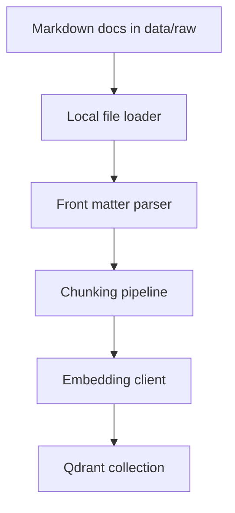
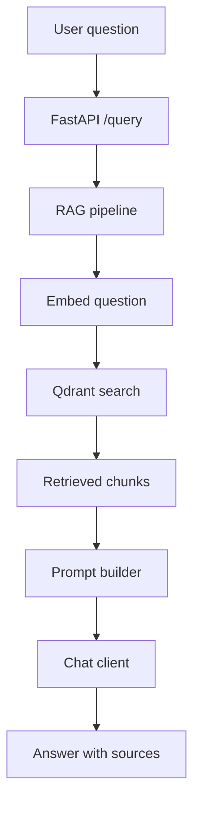
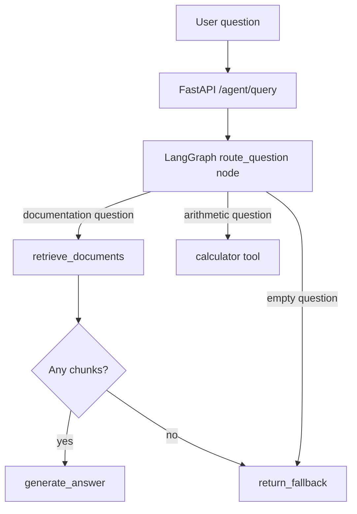
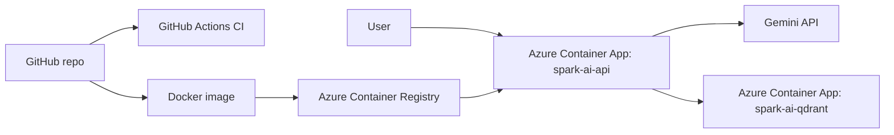

# Spark AI RAG Assistant

Spark AI RAG Assistant is a FastAPI-based retrieval-augmented generation application for Confluence-style documentation. It loads Markdown documents, preserves metadata, chunks content, stores embeddings in Qdrant, retrieves relevant context for a question, and generates grounded answers with cited sources.

The project currently supports two provider paths:

- `gemini` for hosted embeddings and answer generation.
- `ollama` as a local fallback path for embeddings and answer generation.

It also includes a small LangGraph agent endpoint that can route between documentation lookup and a calculator tool.

## Documentation

- [Project learning guide](docs/project_learning_guide.md): the main technical report for the project.
- [FAQ](docs/FAQ.md): common technical questions and answers about the system.

## Project Overview

The application is designed to demonstrate a practical RAG architecture:

- ingest local Markdown documentation from `data/raw`
- parse YAML front matter into structured document metadata
- split documents into retrieval-friendly chunks
- preserve metadata for every chunk
- generate embeddings with the configured provider
- store vectors and payloads in Qdrant
- retrieve relevant chunks for user questions
- build grounded prompts from retrieved context
- generate answers through Gemini or Ollama
- expose RAG, agent, health, and admin APIs through FastAPI
- run locally, in Docker, and on Azure Container Apps

## Architecture

### Indexing Flow



### Query Flow



### Agent Flow



### Deployment Architecture



## Important Design Choices

- FastAPI keeps the API layer small, typed, and easy to test.
- Qdrant is isolated behind a project-specific vector store wrapper.
- Provider selection is centralized in `app/core/providers.py`.
- Metadata is preserved on every chunk so answers can cite title, section, source, space, and URL.
- `/retrieve` exists separately from `/query` so retrieval quality can be debugged without involving answer generation.
- `/agent/query` uses LangGraph to keep routing, tool execution, retrieval, generation, and fallback behavior explicit.
- Integration tests are marked with `pytest.mark.integration` so service-dependent checks do not slow down default local and CI runs.

## Folder Structure

```text
.
|-- app/
|   |-- agent/         # LangGraph agent and tool routing
|   |-- api/           # FastAPI routes
|   |-- core/          # configuration and provider factories
|   |-- embeddings/    # Gemini and Ollama embedding clients
|   |-- generation/    # Gemini and Ollama chat clients, prompt builder
|   |-- ingestion/     # local file loading, parsing, and chunking
|   |-- retrieval/     # RAG pipeline
|   |-- schemas/       # Pydantic request, response, and document models
|   `-- vectorstore/   # Qdrant integration
|-- data/raw/          # local Markdown knowledge base
|-- docker/            # Docker image definition
|-- docs/              # project guide and FAQ
|-- frontend/          # minimal static browser UI
|-- scripts/           # indexing, search, and local query helpers
|-- tests/             # unit-ish and integration tests
|-- docker-compose.yml
|-- pytest.ini
|-- requirements.txt
`-- README.md
```

## API Endpoints

| Endpoint | Purpose |
| --- | --- |
| `GET /` | Serves the minimal frontend |
| `GET /health` | Returns basic service health and environment |
| `POST /retrieve` | Returns retrieved chunks without generating an answer |
| `POST /query` | Runs the normal RAG answer flow |
| `POST /agent/query` | Runs the LangGraph agent flow |
| `POST /admin/reindex` | Rebuilds the Qdrant collection from `data/raw` |

Example `/query` request:

```json
{
  "question": "How does RAG reduce hallucination?",
  "top_k": 4
}
```

Example `/agent/query` calculator request:

```json
{
  "question": "What is 12 * (3 + 2)?",
  "top_k": 4
}
```

## Local Setup

### Prerequisites

- Python 3.11+
- Docker Desktop
- A Gemini API key if using the Gemini provider path
- Ollama if using the local Ollama provider path

### Environment Setup

Create and activate a virtual environment:

```powershell
python -m venv .venv
.venv\Scripts\Activate.ps1
```

Install dependencies:

```powershell
pip install -r requirements.txt
```

Create a local `.env` file from `.env.example`.

Example Gemini configuration:

```env
APP_ENV=local
LOG_LEVEL=INFO
ADMIN_API_KEY=your_admin_api_key

LLM_PROVIDER=gemini
EMBED_PROVIDER=gemini

GEMINI_API_KEY=your_real_gemini_api_key
GEMINI_CHAT_MODEL=gemini-2.5-flash
GEMINI_EMBED_MODEL=gemini-embedding-001

QDRANT_URL=http://localhost:6333
QDRANT_COLLECTION=spark_ai_docs
```

Example Ollama configuration:

```env
APP_ENV=local
LOG_LEVEL=INFO
ADMIN_API_KEY=your_admin_api_key

LLM_PROVIDER=ollama
EMBED_PROVIDER=ollama

OLLAMA_BASE_URL=http://localhost:11434
OLLAMA_EMBED_MODEL=embeddinggemma
OLLAMA_CHAT_MODEL=llama3.2:3b

QDRANT_URL=http://localhost:6333
QDRANT_COLLECTION=spark_ai_docs
```

### Run Locally

Start Qdrant:

```powershell
docker compose up -d qdrant
```

Index the local documents:

```powershell
python scripts/index_chunks.py
```

Start the API:

```powershell
uvicorn app.main:app --reload
```

Useful local URLs:

- Frontend: `http://127.0.0.1:8000/`
- Swagger UI: `http://127.0.0.1:8000/docs`
- Health: `http://127.0.0.1:8000/health`

## Docker

Build the image:

```powershell
docker build -f docker/Dockerfile -t spark-ai-rag-assistant:local .
```

Run the API container:

```powershell
docker run --rm -p 8000:8000 --env-file .env spark-ai-rag-assistant:local
```

Run the app and Qdrant together:

```powershell
docker compose up -d
```

## Tests

Default tests exclude integration tests:

```powershell
pytest
```

Run only integration tests:

```powershell
pytest -m integration
```

Run only non-integration tests:

```powershell
pytest -m "not integration"
```

Current default coverage includes:

- health API
- frontend route
- local document loading
- chunking
- prompt construction
- admin reindex authentication behavior
- LangGraph agent routing
- agent API response shape

## CI

GitHub Actions runs on pushes to `main`, pushes to `feature/**`, and pull requests targeting `main`.

The CI workflow:

- installs dependencies from `requirements.txt`
- runs `pytest -m "not integration"`
- builds the Docker image

Integration tests are kept separate because they require external services such as Qdrant and model providers.

## Azure Deployment

The Azure deployment uses:

- Azure Container Registry for the API image
- Azure Container Apps for the FastAPI API
- Azure Container Apps for Qdrant
- Gemini API for hosted embeddings and answer generation

Current deployed API:

- Health: `https://spark-ai-api.calmbush-6fb83663.westeurope.azurecontainerapps.io/health`
- Swagger UI: `https://spark-ai-api.calmbush-6fb83663.westeurope.azurecontainerapps.io/docs`
- OpenAPI spec: `https://spark-ai-api.calmbush-6fb83663.westeurope.azurecontainerapps.io/openapi.json`

Important API app settings:

- `APP_ENV=azure`
- `LLM_PROVIDER=gemini`
- `EMBED_PROVIDER=gemini`
- `GEMINI_API_KEY=secretref:gemini-api-key`
- `GEMINI_CHAT_MODEL=gemini-2.5-flash`
- `GEMINI_EMBED_MODEL=gemini-embedding-001`
- `QDRANT_URL=http://spark-ai-qdrant:6333`
- `QDRANT_COLLECTION=spark_ai_docs`

Important Qdrant settings:

- internal ingress
- TCP transport
- target port `6333`
- minimum replica count of `1`
- Qdrant bound to `0.0.0.0`

Typical deployment flow:

```powershell
docker build -f docker/Dockerfile -t sparkairagacr.azurecr.io/spark-ai-api:<tag> .
az acr login --name sparkairagacr
docker push sparkairagacr.azurecr.io/spark-ai-api:<tag>
az containerapp update --name spark-ai-api --resource-group rg-spark-ai-demo --image sparkairagacr.azurecr.io/spark-ai-api:<tag>
```

Trigger reindex in Azure:

```powershell
$headers = @{ "x-admin-api-key" = "<your-admin-token>" }
Invoke-RestMethod -Uri "https://<api-fqdn>/admin/reindex" -Method Post -Headers $headers
```

## Known Limitations

- Qdrant persistence is not fully production-hardened in the current Container Apps setup.
- Reindexing recreates the collection, which is simple but destructive.
- Chunking is character-based rather than token-aware.
- Retrieval currently uses vector similarity without reranking or hybrid search.
- Public query endpoints do not include user authentication or rate limiting.
- The project does not yet include an answer-quality evaluation harness.

## Future Improvements

- Add persistent storage or a managed vector database option for Qdrant.
- Add incremental or versioned indexing.
- Add metadata filtering and hybrid search.
- Add a reranking step after initial retrieval.
- Add an evaluation dataset for retrieval and answer quality.
- Add authentication, authorization, rate limiting, and audit logs.
- Expand the frontend with conversation history and source navigation.

## Current Status

Working today:

- local indexing and querying
- Gemini and Ollama provider selection
- FastAPI RAG APIs
- LangGraph agent API
- Qdrant-backed retrieval
- protected admin reindex endpoint
- minimal browser frontend
- Docker packaging
- GitHub Actions CI
- Azure Container Apps deployment
